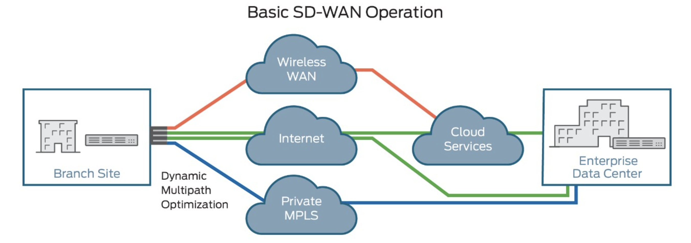
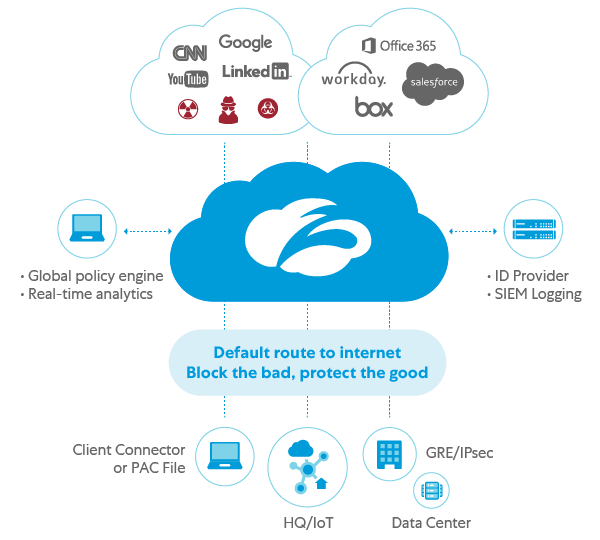
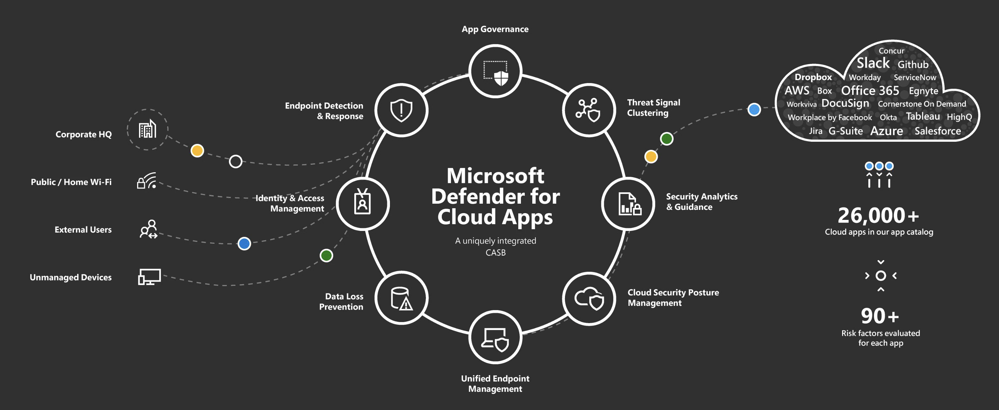
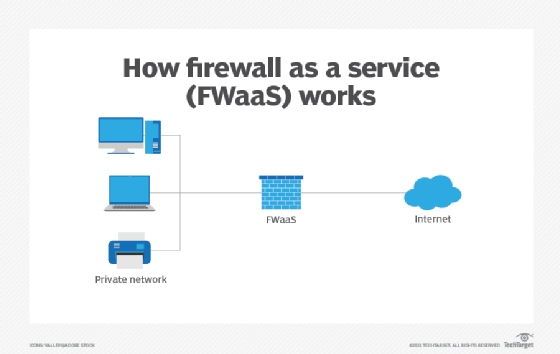
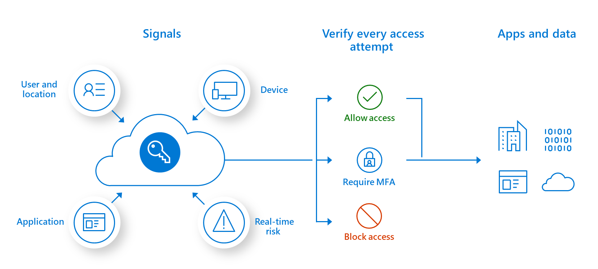

# SASE (Secure Access Service Edge)

**[2022.03.06] @Donggyu Woo**

# SASE 란

SD-WAN (소프트웨어 정의 광대역 네트워크) 과 같은 보안 기능들과 함께 통합된다.

SASE 는 벤더가 클라우드에서 이러한 기능을 서비스로 제공하는 것을 말하며, 아직까지는 완성된 SASE 모델을 제공하는 벤더가 없다. (현재 가장 높은 수즌은 SASE 형태는 클라우드 관리형 SD-WAN 및 클라우드 제공 보안 기능이 통합된 컨버지드 모델이다.)

## SD-WAN (Software-Defined WAN)

SD-WAN (소프트웨어 정의 광대역 네트워크) 는 SDN (Software-Defined WAN) 기술에 기반하여 엔터프라이즈 네트워크에서 MPLS, LTE 및 WAN (광역 통신망) 연결에 적용한 소프트웨어 기반 네트워크 기술이다.

## **SD-WAN, 왜 필요한가?**

전통적인 방식의 엔터프라이즈 WAN 네트워크 운영 환경 측면에서 OpEx (운영비용) 이 상당히 발생한다.

예를 들어, 본사 (Headquarter) 와 다수의 지사 (Branch) 를 두고 있는 조직이라고 가정한다.

1. 새로운 지사 설립에 따라 전용선 또는 MPLS 를 사용 중이라면, 고정 비용 (회선 사용료) 이 지속적으로 발생한다.
2. 지사가 늘어날수록 네트워크 구성 및 추가 보안장비 구매가 필요하고, 이에 따른 관리 리소스가 증가한다. (비용 또한 증가)

위와 같은 문제점으로 인해 비용과 관리 리소스가 지속적으로 증가하게 된다. SD-WAN 을 도입하게 된다면 아래와 같은 이점을 누릴 수 있다.

- WAN OpEx (운영비용) 및 CapEx (투자비용) 절감에 따른 TCO (총 소유비용) 감소한다.
- 네트워크 대응력이 증가하고, 기존의 하드웨어 기반에서 소프트웨어 기반으로 변화하며 SDN 기술을 활용한 중앙 관리 및 제어가 수월하다.
- (1개 이상의 통신사와 계약을 통한) 독립적인 WAN 링크 연결을 제공함으로써 연결 신뢰성을 높인다.
- 모든 유형의 네트워크 트래픽을 동적으로 라우팅하여 애플리케이션과 데이터 제공을 최적화할 수 있다.

## SWG (Secure Web Gateway)

SWG 는 인터넷 상의 웹 기반 위협으로부터 사용자를 보호하기 위해 URL 필터링, 지능형 공격 방어, 레거시 멀웨어 보호, 애플리케이션 제어 기술 등을 사용하여 웹 기반의 보안 정책을 강화할 수 있는 기술이다.

일반적으로 모든 트래픽이 백홀되는 전통적인 허브 앤 스포크 (Hub & Spoke) 모델에서 프록시를 대체한다. 기존의 프록시는 엔드포인트와 인터넷 간의 모든 트래픽을 백홀되고, 해당 망 안에서 악성 콘텐츠를 모니터링하고 지정된 보안 정책에 따라 콘텐츠를 처리한다. 

하지만, 오늘날의 사용자는 지정된 구역이 아닌 외부에 분산되어 있으며 여러 IT 기기를 통해 웹 애플리케이션과 SaaS (Software-as-a-Servie) 에 액세스한다. 이러한 환경 속에서 모든 트래픽을 중앙 위치로 라우팅하면 대기 시간이 길어지고 대역폭이 약화되므로 사용자 입장에서는 성능 면에서 불편함을 겪을 수 밖에 없다. 해당 시스템 구현에 대한 상세 내용은 [다음](https://dhitech.co.kr/page/view.do?id=ref&nttId=203)과 같다.

## CASB (Cloud Access Security Broker)

CASB 는 클라우드 서비스 사용자와 클라우드 애플리케이션 사이에서 모든 활동을 모니터링하고 리소스에 안전하게 액세스하고 사용할 수 있도록 지원하는 기술이다.

기존의 CASB 는 클라우드 서비스 사용자와 제공자 사이에서 주고받는 트래픽을 모니터링하고 IaaS 런타임 활동 감지, 클라우드 리소스의 안전하지 않은 구성 탐지, SaaS 보안 상태 관리 등의 기능을 제공했다.

포레스터에서는 CASB (Cloud Access Security Broker) 를 CSG (Cloud Security Gateway) 라고 명명하면서, SWG (Secure Web Gateway) 와 데이터 유출방지 (DLP), 멀웨어 및 위협 보호, 위협 완화 기능 등을 통합해왔다고 설명했다.

## FWaaS (Firewall as a Service)

FWaaS 는 용어 그대로, “서비스로서의 방화벽" 을 뜻한다. 즉, 도메인 규칙과 URL 필터링 등 어플라이언스 장비가 제공하는 기능들을 지원한다.

어플라이언스 방화벽에 문제가 있어서 FWaaS 를 사용하는 것은 아니다. FWaaS 를 사용하는 이유는 업무 환경의 변화에 있다. 팬데믹으로 인해 업무 환경은 회사에 국한되는 것이 아니라 외부 어디에서든 업무를 수행할 수 있게 되었다.

그렇기에 회사 내부에서 운영되는 어플라이언스 방화벽은 원격 근무를 하는 사용자에게 내부와 동일한 업무 환경을 제공할 수 없다.

다만 단점은 OpEx (운영비용) 이 비싸다. 어플라이언스 장비는 구매한 후, 장비를 운영하기 위한 인력과 유지보수 비용만 든다. 하지만 FWaaS 는 지속적으로 비용을 지불해야 하며, 트래픽을 필터링할 때 전송 지연이 발생한다.

## ZTNA (Zero Trust Network Access)

ZTNA 는 명확하게 정의된 액세스 제어 정책을 기반으로 조직의 애플리케이션, 데이터 및 서비스에 대한 보안 원격 액세스를 제공하는 IT 보안 솔루션이다.

ZTNA 솔루션 내 중요한 기술은 “마이크로 세그멘테이션" 이다. 워크로드 수준에서 세분화된 보안 제어를 적용해 공격자의 수평 이동 (Lateral Movement) 을 방어한다. 

마이크로 세그멘테이션에 신원인증 및 암호화를 적용하며, 실제 침해사고가 발생하더라도 추가 확장이 되지 않도록 제어할 수 있는 기능을 수행하기 때문에 공격 탐지 대응 및 대응 시간을 확보할 수 있다.

VPN 와 비슷하다고 생각할 수 있지만, 명확한 차이점들이 존재한다.

- 원격 근무가 증가함에 따라 기존의 VPN 장비에서는 부하로 인해 지연 시간이 발생할 수 있다. 또한 증가하는 수요에 따른 추가 장비 구매와 운영 리소스 또한 증가하게 된다. ZTNA 솔루션을 클라우드 호스팅 서비스 형태로 구현하게 된다면 앞서 설명한 것과 같은 솔루션 추가 구매 및 운영 리소스 증가에 대한 부담을 덜 수 있다.
- VPN 은 초기 연결 이후 네트워크 전반에 걸쳐 액세스할 수 있다. ZTNA 는 특정 리소스 (애플리케이션, 데이터, 서비스 등) 에 대한 액세스 권한을 부여함으로써 승인되지 않은 요청에 대해서는 액세스할 수 없다.
- VPN 을 사용하기 위해서는 최종 사용자 기기에 VPN 소프트웨어를 설치 및 구성해야 한다. 반면에 ZTNA 에서는 비즈니스 요구에 따라 즉각적으로 보안 정책 및 사용자 권한 추가하거나 제거할 수 있다.

# SASE, 왜 필요한가?

SASE 모델의 등장 배경에는 클라우드의 출현과 SaaS (Software as a Service) 애플리케이션의 도입 가속화에 있다. 

점점 더 많은 데이터와 트래픽이 기존의 On-Premise 에서 클라우드 서비스로 이동하게 되면서, 새로운 네트워크 보안 전략의 필요성이 대두되었다. 

초기에는 SASE 모델의 광범위한 채택이 10년 걸릴 것으로 예측했지만, 팬데믹으로 인해 우리는 언제 어디서나 액세스 가능한 원격 근무 형태로 변화하게 되었고, 조직의 생산성을 유지하기 위해 SaaS 애플리케이션이 빠르게 도입되었지만 그와 동시에 공격자에게는 넓어진 공격 표면을 활용해 조직을 위협할 수 있는 기회가 되기도 했다. 앞으로도 하이브리드 근무 환경의 지원 필요성에 따라 인터넷이 연결된 어느 곳에서든 사용자 (User), 장치 (Device), 애플리케이션 (Application) 을 기반으로 액세스 제어 및 보안 정책 적용이 필요하다.

# SASE 모델에서 제공되는 이점

기존에는 사일로 방식 포인트 솔루션에서 제공된 여러 네트워킹 및 보안 기능이 SASE 모델에서는 통합 클라우드 서비스에 포함되어 제공한다. 이러한 방식의 이점은 다음과 같다.

- 비용 절감 : 여러 포인트 솔루션을 구매하여 관리하는 대신 하나의 플랫폼 사용에 따라 운영 리소스 및 비용이 절감된다.
- 복잡성 완화 : 솔루션을 운영을 위한 여러 작업 (ex. 관리, 업데이트, 유지보수 등) 이 최소화되고, 클라우드 네트워크 보안 서비스 모델로 통합함에 따라 인프라의 복잡성을 완화할 수 있다.
- 생산성 증가 : 모든 디바이스 (모바일, 태블릿 등) 에서 언제 어디서나 동일한 업무 환경을 제공받을 수 있다.
- 보안성 향상 : 위협 방지, 웹 필터링, 샌드박싱, DNS 보안, 자격증명 도용 방지, 데이터 손실 예방, 차세대 방화벽 정책 등에 대한 기능을 제공하며, 일관된 정책을 적용할 수 있다.